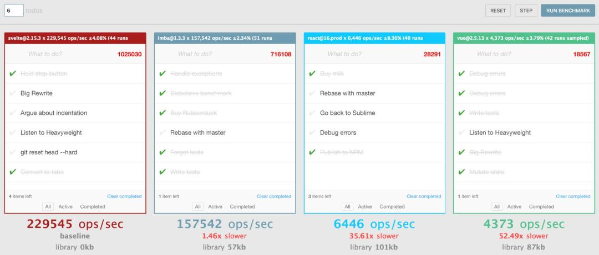

# 

 (v3)

A magically disappearing framework

# A compiler, not a runtime

```html
<!-- App.html -->
<h1>Hello {name}!</h1>
```

|
|

<small>Turns into Vanilla JS in the browser</small>


# Runtimes live in your browser

* Angular, React, Vue
* Interpret your code at runtime


# Compilers live in your dev env

* Turn your apps and components into plain JS
* Work as part of your build flow (webpack, rollup, parcel)


# Why compile?


# Runtimes are big

> Svelte's Todo MVC weighs 3.6kb zipped. For comparison, React plus ReactDOM without any app code weighs about 45kb zipped


# Runtimes provide unnecessary code

* Difficult to tree-shake all of React
* Better to remove dead code or just don't generate it?


# Runtimes are slow 




# Runtimes lock you in

No runtime means code can be re-used in any framework, or no framework.

|
|

Re-using Vue in React or vice-versa requires jumping through hoops. Don't even think about Angular.


# How do you write Svelte?

Components are done in a single file, like Vue or React.

```html
<!-- Greeting.html -->
<h1>Hi, {name}, I'm your component!</h1>

<script>
  export let name = 'Bob';
</script>

<style>
  h1 {
    color: blue;
  }
</style>
```


# How do you use Svelte components?


```js
const greet = new Greeting({
  target: document.body,
  props: {
    name: 'Fred',
  },
});

// Plain prop accessors
greet.name = 'Bobby';

// Set multiple props
greet.$set({ name: 'Jimmy' });
```


# How you do you build with components?

```html
<!-- App.html -->
<div>
  <Greeting name={name}></Greeting>
</div>

<script>
  import Greeting from './Greeting.html';

  let name = 'Randall';
</script>
```